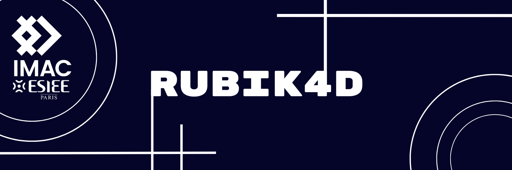

# Rubik4D : a puzzle game that innovates 4D Rubik’s cube representation

The Rubik4D is a tutored project for [IMAC](https://www.ingenieur-imac.fr/), an engineer course mixing art and science.  
The main goal is to find an aesthetic representation of a 2x2x2x2 Rubik's cube.

## The concept

Media/rubiks_3D_circles.mp4

<!-- <video width="320" height="240" controls>
  <source src="Media/rubiks_3D_circles.mp4" type="video/mp4">
</video> -->

## Credits
### Tutors
- Shohei HIDAKA
- Vincent NOZICK

### Authors 
- [Logan ARGOUSE](https://github.com/Oradimi)
- [Mélodie KOUY](https://github.com/melokye)
- [Matthieu MECHINEAU](https://github.com/MMeche)

### Special thanks to 
- [Hactar](https://ajfarkas.dev/) who helped us a lot in this project 
- The [members of the Hypercubers Discord server](https://discord.com/invite/Rrw2xeB3Gb)

---
## Releases
- [Online version](https://oradimi.itch.io/rubik4d)
- [20/12/2023](https://github.com/melokye/IMAC2_Rubik4D/releases)
